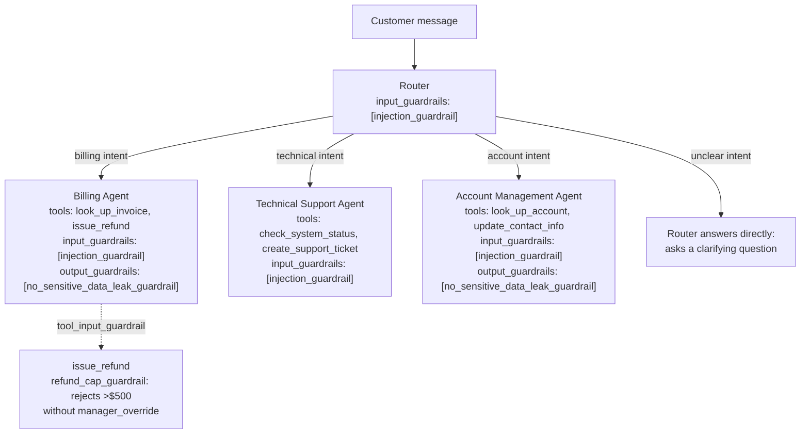

# Architecture

## Agent topology

Four `Agent`s (`src/agents_def.py`): a `Router` with no tools, three
`handoff` targets, and an input guardrail; three specialists, each with
its own tools and, where the tool output could contain sensitive data
(billing, account), an output guardrail. The router never guesses past a
handoff -- if intent doesn't clearly match billing/technical/account
keywords, it answers directly with a clarifying question rather than
forcing a handoff (see `demo_model.router_decide`'s final branch).

## Model selection: real Responses API vs. local demo model

No agent passes `model=` when `OPENAI_API_KEY` is set (`agents_def.py`'s
`_model_for`) -- every agent then runs on the Agents SDK's own default,
`OpenAIResponsesModel`, i.e. real Responses API calls. This satisfies the
lab brief's Responses API requirement with the SDK's actual default
behavior rather than a workflow special-cased to check a box.

This development environment has no OpenAI account/API key configured,
so every agent instead runs on `DemoModel` (`src/demo_model.py`): a
deterministic, keyword-driven stand-in implementing the same `Model`
interface, built and inspected directly against the installed
`openai-agents==0.22.0` package (not guessed from documentation -- see
"Bugs found by actually running this" below for what that caught). This
is the same honest trade-off used throughout this project's sibling
labs: real, correct SDK usage exercised end to end against a fake model,
clearly labeled, instead of an untested claim.

## Guardrails (all three types, per the lab brief)

| Type | Where | What it does | Demonstrated in |
|---|---|---|---|
| Input | `injection_guardrail`, on every agent | Blocks known prompt-injection phrasing before any agent acts on the message | `examples/outputs/06_input_guardrail_injection_blocked.json` |
| Output | `no_sensitive_data_leak_guardrail`, on Billing + Account | Blocks a final response containing an unmasked card number or SSN-shaped string | `examples/outputs/07_output_guardrail_card_number_blocked.json` |
| Tool | `refund_cap_guardrail`, on `issue_refund` | Rejects a refund over $500 unless `manager_override=True` -- rejected *before* the tool body (and its audit-log write) ever runs | `examples/outputs/05_tool_guardrail_refund_over_threshold.json` |

The tool guardrail is the lab brief's required "one guardrail
demonstration" -- but all three actually trip in the captured sample
run, not just one, because each is cheap to demonstrate once the real
one was built and verified.

## Stateful conversation management

`SQLiteSession` (a real class in the installed SDK, not custom code)
persists conversation history per session ID. `examples/outputs/
01_billing_balance_lookup.json` and `02_billing_followup_refund_small.json`
are two separate `Runner.run()` calls sharing one `SQLiteSession` --
the second call ("can I get a $50 refund on that?") correctly resolves
"that" via the session's own persisted history, and the router still
routes it back to Billing without the customer re-stating context.

## Tracing

Every agent decision, handoff, tool call, and guardrail check is
captured by `LocalFileTracingProcessor` (`src/tracing_local.py`), which
calls the SDK's own `Span.export()` / `Trace.export()` -- the same
serialization the OpenAI dashboard exporter uses internally -- and
writes each to `examples/traces/trace.jsonl`. This replaces "tracing
screenshots" with the actual data those screenshots would show, since no
OpenAI dashboard access exists in this environment; see the design doc
for a worked example read directly from that file.

## Bugs found by actually running this

Two real defects surfaced only by running the system end to end, not by
writing the code alone:

1. **Reused tool-call IDs crashed the SDK.** An early version of
   `DemoModel` hardcoded `call_id="call_1"` for every tool/handoff call.
   The SDK raised `ModelBehaviorError: Model reused a completed tool call
   ID for a different invocation` the moment a second call happened in
   the same run (a handoff followed by a tool call). Fixed with a global
   `itertools.count()` generating a unique ID per call across the whole
   process.
2. **A stateful follow-up wrongly reused a prior turn's tool result.**
   `tool_output_for()` originally searched the *entire* session history
   for a matching tool name, so scenario 2's "can I get a $50 refund on
   that?" (in the same session as scenario 1's balance lookup) found
   turn 1's `look_up_invoice` output and answered with the old balance
   instead of calling `issue_refund`. Fixed by scoping the search to only
   the items *after* the current user message (`_items_since_latest_user_message`).
